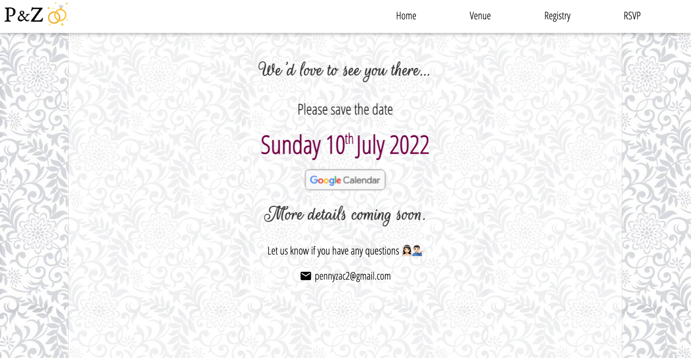

# 💐 Save the Date - A React Website

A single-page web application built in React. My first side project after General Assembly's Software Engineering Immersive. I am currently working on adding a backend with Django and a PostgresSQL database that will store user account information, RSVP details, and dietary requests.

### Developed by:
* Penny Jungreis - [GitHub](https://github.com/penelopecj)

## Deployment
I deployed this website using Netlify and it is available [_here_](https://pennyandzac.com/). 

## Technologies Used
  * JavaScript (ES6)
  * React
  * SASS
  * VS Code
  * Git + GitHub
  * Netlify

## Features
* JS live countdown to wedding day.
* Responsive design with toggle menu for smaller screens.
* Google Calendar automatic event add button.

**Homepage**

**Venue**

**Registry**

**RSVP**

